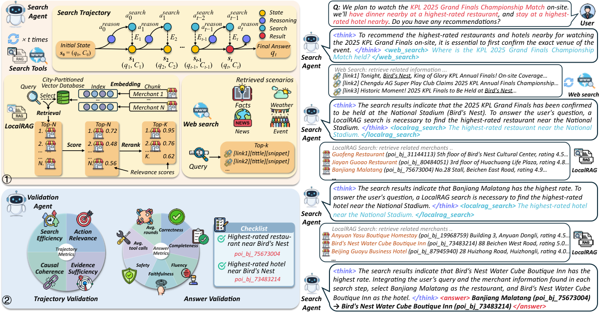
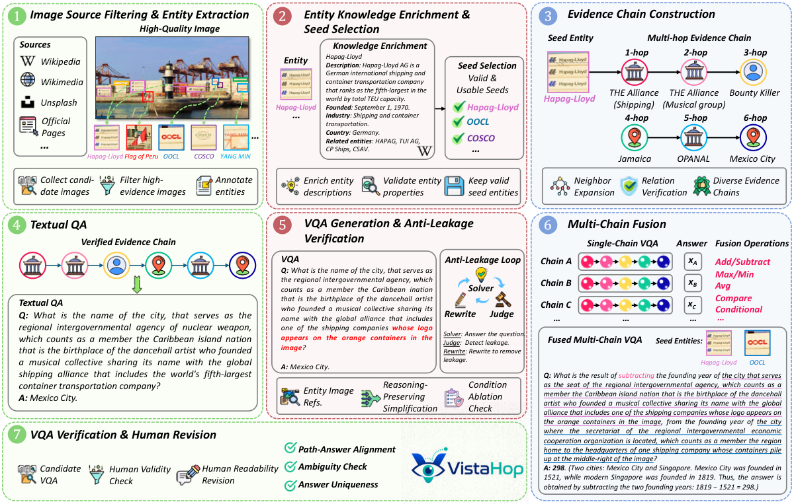
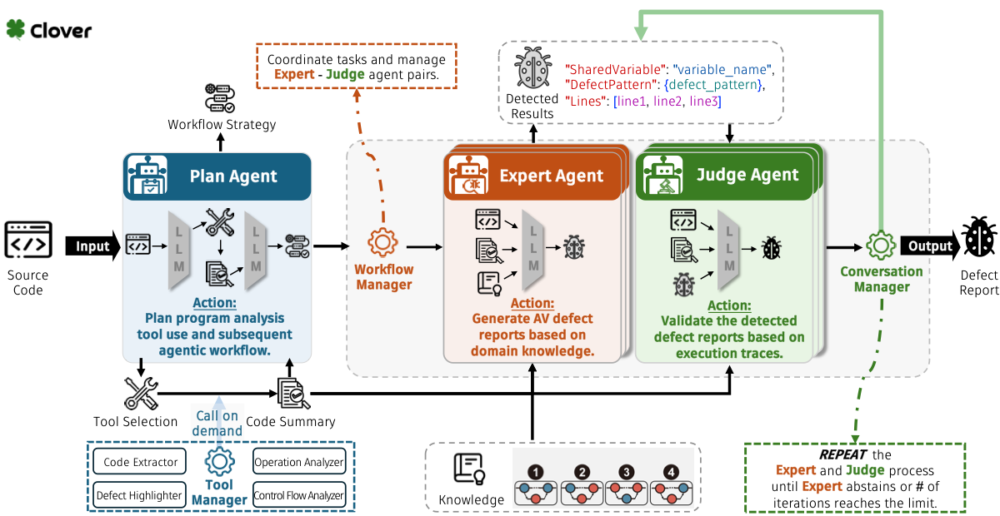
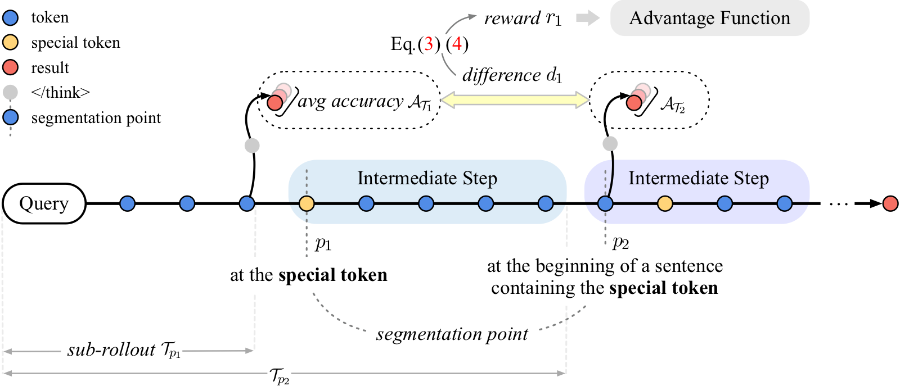
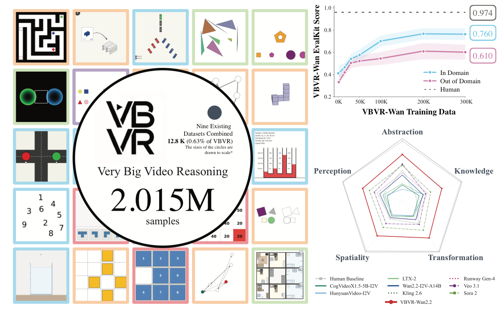
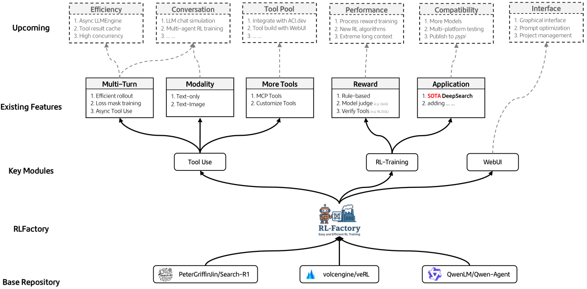
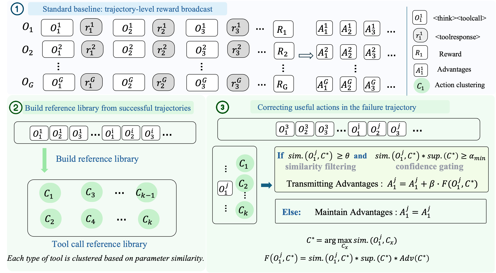
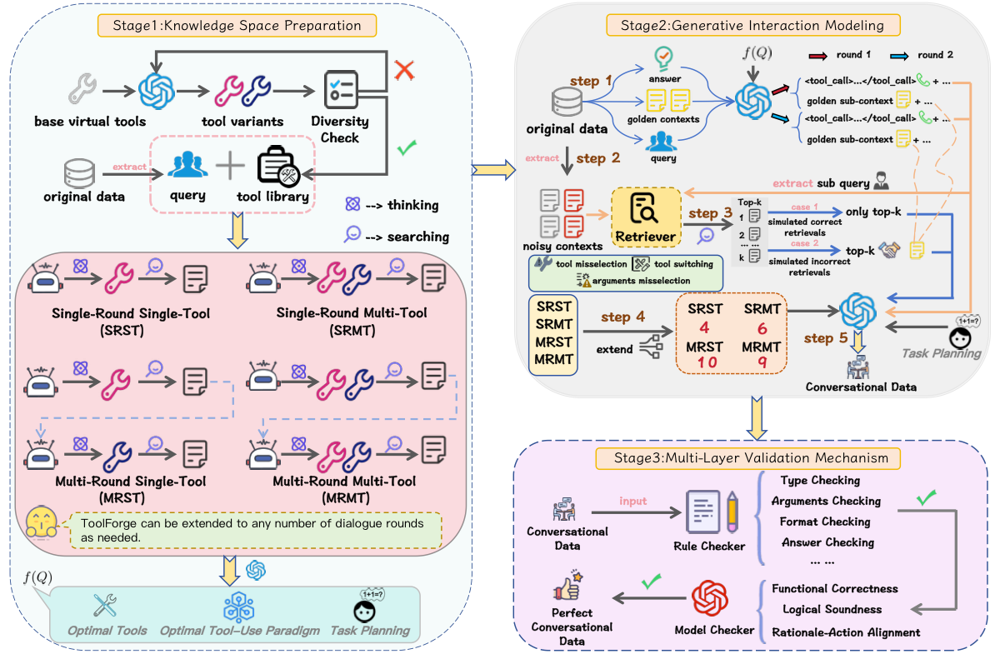
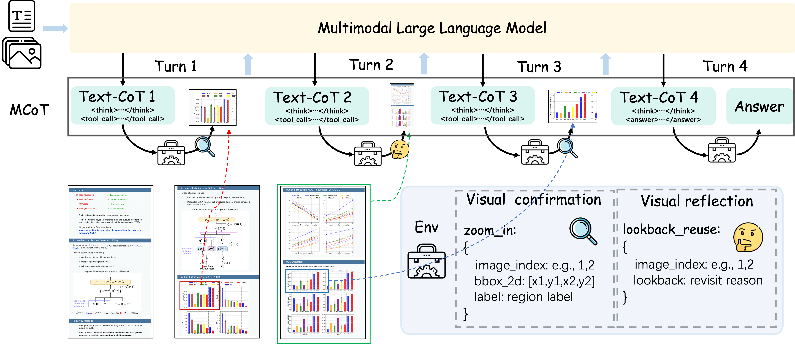

I am an incoming Ph.D. student at the [FudanNLP Lab](https://nlp.fudan.edu.cn/), [Fudan University](https://www.fudan.edu.cn/), and [Shanghai Innovation Institute](https://www.sii.edu.cn/), advised by Prof. [Tao Gui (桂韬)](https://guitaowufeng.github.io/) and Prof. [Xuanjing Huang (黄萱菁)](https://xuanjing-huang.github.io/).
I am currently a second-year graduate student at [East China Normal University](https://www.ecnu.edu.cn/) (2024-2027), co-advised by Prof. [Chengcheng Wan (万成城)](https://chengcheng-wan.github.io/) and Prof. [Ting Su (苏亭)](https://tingsu.github.io/). I received my B.S. from [China University of Petroleum, Beijing](https://www.cup.edu.cn/) in 2024.我即将加入[复旦大学自然语言处理实验室](https://nlp.fudan.edu.cn/)和[上海创智学院](https://www.sii.edu.cn/)攻读博士学位，在[桂韬](https://guitaowufeng.github.io/)老师和[黄萱菁](https://xuanjing-huang.github.io/)老师的指导下开展研究。目前我是[华东师范大学](https://www.ecnu.edu.cn/)二年级研究生（2024-2027），师从[万成城](https://chengcheng-wan.github.io/)研究员与[苏亭](https://tingsu.github.io/)教授。我于 2024 年在[中国石油大学（北京）](https://www.cup.edu.cn/)获得学士学位。

My research interests include **Agent & Harness**, **Agentic RL (Tool Call)**, and **Multimodal large language models**.我的研究兴趣包括**智能体与任务执行框架（Agent & Harness）**、**面向工具调用的智能体强化学习（Agentic RL for Tool Call）**与**多模态大语言模型**。

Feel free to reach out by email; I am always happy to discuss research ideas and collaborations. ✉️欢迎通过邮件联系我，我很乐意交流研究想法与合作机会。✉️

# 🔥 News最新动态 {#news}
- *2026.06*: 🎉🎉 **[VistaHop](https://arxiv.org/abs/2606.03273)** is released on arXiv!🎉🎉 **[VistaHop](https://arxiv.org/abs/2606.03273)** 已发布于 arXiv！
- *2026.05*: 🎉🎉 **[LocalSearchBench](https://arxiv.org/abs/2512.07436)** is accepted by **SIGKDD 2026**!🎉🎉 **[LocalSearchBench](https://arxiv.org/abs/2512.07436)** 已被 **SIGKDD 2026** 录用！
- *2026.05*: 🎉🎉 **[A Very Big Video Reasoning Suite](https://arxiv.org/abs/2602.20159)** is accepted by **ICML 2026**!🎉🎉 **[A Very Big Video Reasoning Suite](https://arxiv.org/abs/2602.20159)** 已被 **ICML 2026** 录用！
- *2025.12*: 🎉🎉 **[Promoting Efficient Reasoning with Verifiable Stepwise Reward](https://arxiv.org/abs/2508.10293)** is accepted by **AAAI 2026**!🎉🎉 **[Promoting Efficient Reasoning with Verifiable Stepwise Reward](https://arxiv.org/abs/2508.10293)** 已被 **AAAI 2026** 录用！
- *2025.04*: 🎉🎉 **[Clover](https://arxiv.org/abs/2504.00521)** is released on arXiv!🎉🎉 **[Clover](https://arxiv.org/abs/2504.00521)** 已发布于 arXiv！

# 📝 Publications论文发表 {#publications}

SIGKDD 2026

### LocalSearchBench: Benchmarking Agentic Search in Real-World Local Life Services

**Hang He**, _Chuhuai Yue, Chengqi Dong, Mingxue Tian, Hao Chen, Zhenfeng Liu, Jiajun Chai*, Xiaohan Wang, Yufei Zhang, Qun Liao, Guojun Yin†, Wei Lin, Chengcheng Wan†, Haiying Sun, Ting Su†_

- Accepted by **SIGKDD 2026** (CCF A).录用于 **SIGKDD 2026**，CCF A。
- LocalSearchBench is the first comprehensive benchmark for agentic search in local life services, built around real-world merchant data, multi-hop user queries, and constraints such as location, time, ratings, prices, and service availability.LocalSearchBench 是首个面向本地生活服务场景的综合 Agentic Search 评测基准，围绕真实商户数据、多跳用户查询，以及位置、时间、评分、价格、服务可用性等约束构建。
- It introduces LocalPlayground, a unified tool-interaction environment for evaluating whether agents can plan, retrieve, reason, and faithfully synthesize answers across complex local-service workflows.我们进一步构建 LocalPlayground 统一工具交互环境，用于评估智能体在复杂本地生活服务流程中进行规划、检索、推理，并可靠地综合答案的能力。
- <a class="pub-badge pub-badge--hf" href="https://huggingface.co/datasets/localsearchbench/localsearchbench">🤗Hugging Face</a>|<a class="pub-badge pub-badge--paper" href="https://arxiv.org/abs/2512.07436">Paper</a>|<a class="pub-badge pub-badge--slide" href="../files/LocalSearchBench.pdf?v=20260625"><i class="fas fa-file-powerpoint"></i>Slide</a>|<a class="pub-badge pub-badge--video" href="https://www.bilibili.com/video/BV1nm786eEjC/?spm_id_from=333.1387.homepage.video_card.click">Video</a>|<a class="pub-badge pub-badge--website" href="https://localsearchbench.github.io/"><i class="fas fa-globe-americas"></i>Website</a>|<a class="pub-badge pub-badge--report" href="https://mp.weixin.qq.com/s/-zVRQe4ISf_Sbanc_tVtzg"><i class="fab fa-weixin"></i>Report (美团技术团队)</a>

Arxiv 2026

### VistaHop: Benchmarking Multi-hop Visual Reasoning for Visual DeepSearch

**Hang He**, _Chuhuai Yue, Chengqi Dong, Chengcheng Wan†, Ting Su, Haiying Sun, Jiajun Chai, Xiaohan Wang, Guojun Yin†_

- VistaHop is a benchmark for Visual DeepSearch, evaluating whether multimodal agents can repeatedly inspect images, ground intermediate reasoning in visual evidence, and connect fine-grained clues across long reasoning chains.VistaHop 是面向 Visual DeepSearch 的评测基准，用于评估多模态智能体能否反复检查图像、将中间推理扎根于视觉证据，并在长推理链中连接细粒度线索。
- It contains 300 high-resolution images, 25 visual search scenarios, and 350 multi-hop VQA tasks, together with VistaArena, a unified tool-interaction environment for visual retrieval, image inspection, and evidence-grounded reasoning.VistaHop 包含 300 张高分辨率图像、25 类视觉搜索场景与 350 个多跳视觉问答任务，并构建 VistaArena 统一工具交互环境，支持视觉检索、图像检查与基于证据的推理。
- <a class="pub-badge pub-badge--paper" href="https://arxiv.org/abs/2606.03273">Paper</a>|<a class="pub-badge pub-badge--code" href="https://github.com/ahang0712/vistahop"><i class="fab fa-github"></i>Code</a>

Arxiv 2025

### Automated Detection of Atomicity Violations in Large-Scale Systems

**Hang He***, Yixing Luo*, _Chengcheng Wan†, Ting Su†, Haiying Sun, Geguang Pu_

- Clover is a multi-agent framework for detecting atomicity violations in real-world interrupt-driven programs.Clover 是一个用于检测真实中断驱动程序中原子性违反问题的多智能体框架。
- It combines a Plan Agent with static analysis tools and Expert-Judge agent pairs, enabling iterative detection and validation of atomicity-violation patterns in real aerospace software code.Clover 将 Plan Agent、静态分析工具与 Expert-Judge 智能体对结合起来，支持在真实航天软件代码中对原子性违反模式进行迭代检测与验证。
- <a class="pub-badge pub-badge--paper" href="https://arxiv.org/abs/2504.00521">Paper</a>

AAAI 2026

### Promoting Efficient Reasoning with Verifiable Stepwise Reward

Chuhuai Yue, _Chengqi Dong, Yinan Gao, **Hang He**, Jiajun Chai, Guojun Yin, Wei Lin_

- Accepted by **AAAI 2026** (CCF A).录用于 **AAAI 2026**，CCF A。
- This work targets the overthinking problem in large reasoning models, where models spend excessive tokens on simple questions and sacrifice inference efficiency.该工作关注大推理模型中的过度思考问题，即模型在简单问题上消耗过多推理 token，从而降低推理效率。
- It proposes a rule-based Verifiable Stepwise Reward Mechanism (VSRM) that rewards effective intermediate reasoning states and penalizes ineffective steps, reducing output length while preserving reasoning performance.我们提出基于规则的可验证逐步奖励机制（VSRM），对有效中间推理状态给予奖励、对无效步骤进行惩罚，在保持推理性能的同时显著缩短输出长度。
- <a class="pub-badge pub-badge--paper" href="https://arxiv.org/abs/2508.10293">Paper</a>|<a class="pub-badge pub-badge--report" href="https://mp.weixin.qq.com/s/8OiJucbM3TkZ0FUTVGnAIA"><i class="fab fa-weixin"></i>Report (量子位)</a>

ICML 2026

### A Very Big Video Reasoning Suite

Maijunxian Wang, Ruisi Wang, _..._, **Hang He**, _..._, Alan Yuille, Yilun Du, Ziming Liu, Bo Li, Dahua Lin, Ziwei Liu, Vikash Kumar, Yijiang Li, Lei Yang, Zhongang Cai, Hokin Deng

- Accepted by **ICML 2026** (CCF A).录用于 **ICML 2026**，CCF A。
- VBVR is a large-scale suite for studying video reasoning beyond visual quality, focusing on spatiotemporal structure such as continuity, interaction, and causality.VBVR 是一个面向视频推理的大规模研究套件，不仅关注视觉质量，还系统考察连续性、交互关系与因果关系等时空结构推理能力。
- It introduces a dataset spanning 200 curated reasoning tasks and over one million video clips, together with VBVR-Bench, a verifiable evaluation framework with rule-based, human-aligned scorers.该工作构建了覆盖 200 类精心设计推理任务、超过 100 万个视频片段的数据集，并提出 VBVR-Bench 可验证评测框架，通过基于规则且符合人类判断的评分器进行可复现评估。
- <a class="pub-badge pub-badge--paper" href="https://arxiv.org/abs/2602.20159">Paper</a>|<a class="pub-badge pub-badge--website" href="https://video-reason.com/"><i class="fas fa-globe-americas"></i>Website</a>|<a class="pub-badge pub-badge--code" href="https://github.com/Video-Reason/VBVR-EvalKit"><i class="fab fa-github"></i>Code</a>|<a class="pub-badge pub-badge--report" href="https://mp.weixin.qq.com/s/XaLnom_nFvnoeFJR506-8w"><i class="fab fa-weixin"></i>Report (新智元)</a>

Arxiv 2025

### RLFactory: A Plug-and-Play Reinforcement Learning Post-Training Framework for LLM Multi-Turn Tool-Use

Jiajun Chai, _Guojun Yin, Zekun Xu, Chuhuai Yue, Yi Jia, Siyu Xia, Xiaohan Wang, Jiwen Jiang, Xiaoguang Li, Chengqi Dong, **Hang He**, Wei Lin_

- RLFactory is a plug-and-play reinforcement learning post-training framework for multi-turn tool-use agents, integrating rollout generation, reward design, and RL training into a unified workflow.RLFactory 是一个面向多轮工具调用智能体的即插即用式强化学习后训练框架，将轨迹生成、奖励设计与强化学习训练整合到统一流程中。
- It supports efficient training for LLM agents across text and multimodal tool-use scenarios, making it easier to build, evaluate, and iterate on tool-augmented agent systems.该框架支持在文本与多模态工具调用场景中高效训练大模型智能体，便于构建、评估和迭代工具增强型智能体系统。
- <a class="pub-badge pub-badge--paper" href="https://arxiv.org/abs/2509.06980">Paper</a>|<a class="pub-badge pub-badge--code" href="https://github.com/Simple-Efficient/RL-Factory"><i class="fab fa-github"></i>Code</a>|<a class="pub-badge pub-badge--report" href="https://mp.weixin.qq.com/s/jvqBJU1gsvkKkeBX_R0fnw"><i class="fab fa-weixin"></i>Report (深度学习与自然语言处理)</a>|<a class="pub-badge pub-badge--stars" href="https://github.com/Simple-Efficient/RL-Factory" data-github-stars="Simple-Efficient/RL-Factory"><i class="fas fa-star"></i>Stars</a>

Arxiv 2026

### TAPO: Tool-Aware Policy Optimization via Credit Transfer for Multimodal Search Agents

Chengqi Dong, Chuhuai Yue, **Hang He**, _Yandong Liu, Fenghe Tang, S Kevin Zhou, Xiaohan Wang, Jiajun Chai, Guojun Yin_

- <a class="pub-badge pub-badge--paper" href="https://arxiv.org/abs/2606.05784">Paper</a>

Arxiv 2025

### ToolForge: A Data Synthesis Pipeline for Multi-Hop Search without Real-World APIs

Hao Chen, Zhexin Hu, Jiajun Chai, Haocheng Yang, **Hang He**, _Xiaohan Wang, Wei Lin, Luhang Wang, Guojun Yin, Zhuofeng Zhao_

- <a class="pub-badge pub-badge--paper" href="https://arxiv.org/abs/2512.16149">Paper</a>|<a class="pub-badge pub-badge--code" href="https://github.com/Buycar-arb/ToolForge"><i class="fab fa-github"></i>Code</a>

Arxiv 2025

### Training Multi-Image Vision Agents via End2End Reinforcement Learning

_Chengqi Dong, Chuhuai Yue_, **Hang He**, _Rongge Mao, Fenghe Tang, S Kevin Zhou, Zekun Xu, Xiaohan Wang, Jiajun Chai, Wei Lin, Guojun Yin_

- <a class="pub-badge pub-badge--paper" href="https://arxiv.org/abs/2512.08980">Paper</a>

# 💻 Internship实习经历 {#internship}

- **NEX-AGI**, Shanghai Qiji Zhifeng Co., Ltd., Shanghai**NEX-AGI**，上海奇绩智峰，上海 *Research directions: General Agent (long-horizon agent task synthesis and Agentic RL)**研究方向：通用智能体（长程智能体任务合成及其 Agentic RL）*
- Advised by [Zhou Shao (邵洲)](https://scholar.google.com/citations?view_op=list_works&hl=zh-CN&hl=zh-CN&user=d7Aflf0AAAAJ), and [Rui Zheng (郑锐)](https://scholar.google.com/citations?hl=en&user=7Z0V_SoAAAAJ&view_op=list_works&sortby=pubdate).由[邵洲](https://scholar.google.com/citations?view_op=list_works&hl=zh-CN&hl=zh-CN&user=d7Aflf0AAAAJ)与[郑锐](https://scholar.google.com/citations?hl=en&user=7Z0V_SoAAAAJ&view_op=list_works&sortby=pubdate)指导。
- **Meituan**, Search and Recommendation Platform Department, Agentic System X (ASX) Team**美团**，搜索和推荐平台部，Agentic System X (ASX) 团队 *Research directions: reinforcement learning, multimodal post-training, and multimodal retrieval**研究方向：强化学习、多模态后训练与多模态检索*
- Advised by [Jiajun Chai](https://scholar.google.com/citations?user=yDdfap0AAAAJ&hl=en), and [Guojun Yin](https://gjyin.github.io/).由[柴嘉骏](https://scholar.google.com/citations?user=yDdfap0AAAAJ&hl=en)与[殷国君](https://gjyin.github.io/)指导。

# 🎤 Service and Talks服务与报告 {#service-and-talks}

1. Reviewer for ACL ARR, SIGKDD 2026, ACM MM 2026, CVPR 2026, and WWW 2026.ACL ARR、SIGKDD 2026、ACM MM 2026、CVPR 2026 与 WWW 2026 审稿人。
2. Transformer Seminar Host.Transformer Seminar 主持人。

# 🎖 Awards荣誉奖项 {#awards}

1. National Scholarship, 2022.国家奖学金，2022。
2. Outstanding Graduate Award, Beijing, 2024.北京市优秀毕业生，2024。
3. Sinopec Talent Scholarship, 2021.中国石化英才奖学金，2021。

# 📖 Education教育经历 {#education}

- *2024 - Present*, Graduate student, **East China Normal University**.*2024 - 至今*，研究生，**华东师范大学**。
- *2020 - 2024*, B.S., **China University of Petroleum, Beijing**.*2020 - 2024*，学士，**中国石油大学（北京）**。

<section class="visitor-map" id="visitor-map">
  <h1>Visitor Statistics访客统计</h1>
  

    
  

</section>

